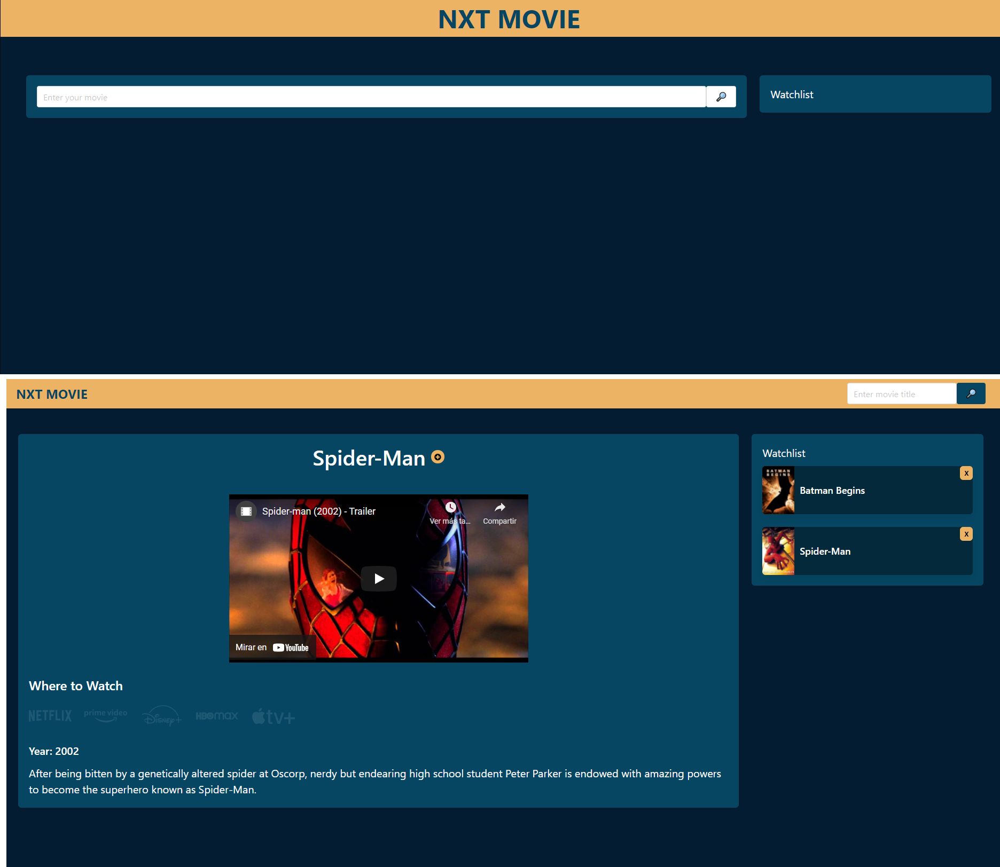

# nxt-movie

This is a team project that required the use of all the technologies and skills that have been adquired so far.

The requirement were:

-Use a CSS framework other than Bootstrap.
-Be deployed to GitHub Pages.
-Be interactive.
-Use at least two server-side APIs.
-Use modals from interactions
-Use client-side storage to store persistent data.
-Be responsive.
-Have a polished UI.
-Have a clean repository.
-Have a quality README.

After deciding what type of application and APIs were going to be used, the tasks were assigned and the development started. 

The application was designed to help users search for a movie, see the trailer, see on what streaming platform that movie is available on, and can create a watchlist of movies the user would like to watch next. 

It was made using Bulma as a CSS Framework, HTML, CSS and Javascript. Two APIs were used, one for searching for movies and the other to get streaming information. 

The main challenges as working as a team were related to the use of Github and some difficulties with the assignment of tasks.

Finally, a working application was debugged, checked and finally deployed.

 [Final Product:Github repository](https://github.com/isaacgalvan10/nxt-movie)

 [Final Product:Code Quiz](https://isaacgalvan10.github.io/nxt-movie/)

[Document Presentation](https://onedrive.live.com/view.aspx?resid=124BCA53E6F59F19!82298&ithint=file%2cpptx&authkey=!AHVscf0fYc7J3lQ)

